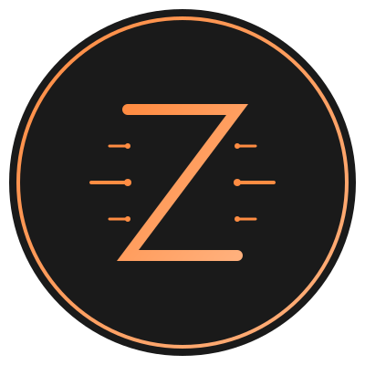

# Ziglet: A Minimalist, High-Performance Virtual Machine in Zig

[](LICENSE)
[](https://github.com/chrischtel/Ziglet)
<!-- Replace chrischtel -->

<!-- Add a visually appealing logo here (if you have one) -->


**Ziglet is a small, fast, and embeddable virtual machine written in Zig. Designed for performance and simplicity, Ziglet provides a versatile platform for running sandboxed code, scripting game logic, and more.  It's a playground for experimentation and a foundation for building lightweight, secure applications.**

## ✨ Key Features

*   **Minimal Core:** A lean instruction set for maximum efficiency and ease of understanding.
*   **High Performance:** Leverages Zig's capabilities for near-native execution speeds.
*   **Easy Embeddability:** Simple C API for seamless integration into existing projects.
*   **Secure Design:** Prioritizes security to prevent common VM vulnerabilities and ensure safe execution of untrusted code.
*   **Extensible Architecture:** Designed for easy addition of custom instructions and features.

## 🚀 Getting Started

While Ziglet is still under active development, you can explore the codebase and contribute to its evolution:

1.  **Clone the repository:**
    ```bash
    git clone https://github.com/chrischtel/Ziglet.git
    cd Ziglet
    ```

2.  **Build the project:**
    ```bash
    zig build
    ```

3.  **Run the tests:**
    ```bash
    zig build test
    ```

4.  **Explore the examples (coming soon):**
    *   Simple "Hello, World!" program
    *   Basic arithmetic operations
    *   (More examples demonstrating different features will be added soon)

## 💡 Why Ziglet?

Ziglet aims to provide a "Swiss Army Knife" VM solution, offering:

*   **Performance:** Achieve competitive performance compared to other lightweight VMs, especially in resource-constrained environments.
*   **Flexibility:** Adaptable to a wide range of applications, from embedded systems to game development.
*   **Learnability:** A clean and well-documented codebase that serves as an excellent learning resource for understanding VM internals and Zig programming.
*   **Security:** Build secure and isolated environments for running untrusted code.

## 🎯 Potential Use Cases

Ziglet can be used in a variety of scenarios:

*   **Game Scripting:** Embed Ziglet into a game engine to enable scripting of game logic and AI. Imagine creating complex game behaviors with a lightweight and performant scripting language.
*   **Embedded Systems:** Run small, isolated applications on resource-constrained embedded devices. Ziglet's small footprint and performance make it ideal for this purpose.
*   **Sandboxing Untrusted Code:** Execute untrusted code in a safe and isolated environment. Protect your system from malicious code by running it within Ziglet's secure sandbox.
*   **Educational Tool:** Use Ziglet as a learning tool for understanding VM concepts and Zig programming. The clear and concise codebase makes it easy to learn and experiment.
*   **Custom Language Runtimes:** Build your own domain-specific language (DSL) on top of Ziglet. Define your own instruction set and create a custom runtime environment tailored to your specific needs.

## 🗺️ Roadmap

Ziglet's development is guided by the following roadmap:

*   **Core VM Foundation:**
    *   Defining and implementing the core instruction set architecture (ISA).
    *   Developing the execution engine and memory management system.
    *   Establishing a robust testing framework.
*   **Embeddability and API:**
    *   Creating a stable and well-documented C API for seamless integration into other projects.
    *   Providing examples of embedding Ziglet into C/C++ and other languages.
*   **Performance Optimization:**
    *   Profiling and optimizing the VM for maximum speed and efficiency.
    *   Exploring techniques such as JIT compilation and custom memory allocators.
*   **Feature Expansion:**
    *   Adding support for floating-point numbers, strings, and other data types.
    *   Implementing debugging features and tools.
    *   Extending the instruction set with new operations and capabilities.
*   **Security Enhancements:**
    *   Implementing advanced security features such as memory protection and code isolation.
    *   Conducting security audits and penetration testing.

## 📣 Call for Early Adopters

We are looking for early adopters to help us shape the future of Ziglet! If you are interested in:

*   Experimenting with a minimalist VM in Zig
*   Contributing to an open-source project
*   Providing feedback and suggestions

Then we encourage you to:

*   Clone the repository
*   Join our [Discord server](YOUR_DISCORD_LINK) (coming soon)
*   Submit issues and pull requests

## 🤝 Contributing

We welcome contributions from the Zig community! Check out our [Contribution Guidelines](CONTRIBUTING.md) (coming soon) for more information on how to get involved.

## 📄 License

Ziglet is licensed under the [MIT License](LICENSE).

## 🙏 Acknowledgements

*   The Zig programming language and its community.
*   (Add any other acknowledgements here)

---

**Stay tuned for more updates!**

**Follow us on [Twitter](YOUR_TWITTER_LINK) (coming soon) for the latest news and announcements.**
